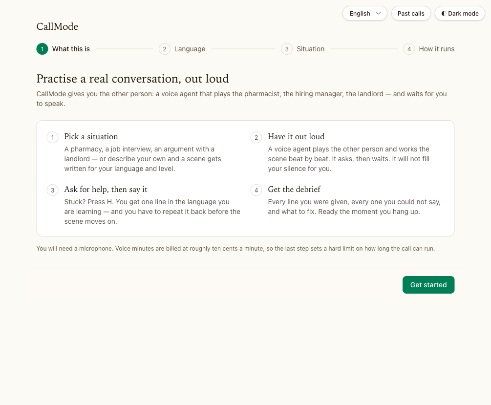
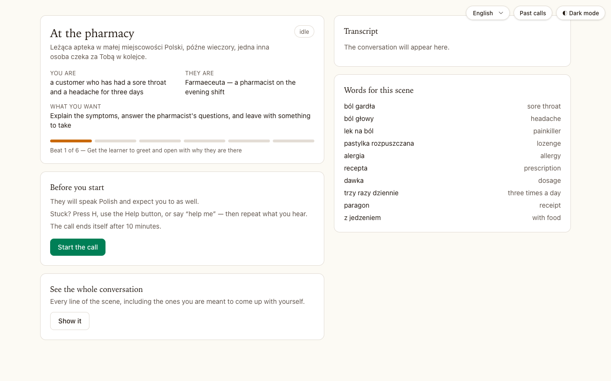
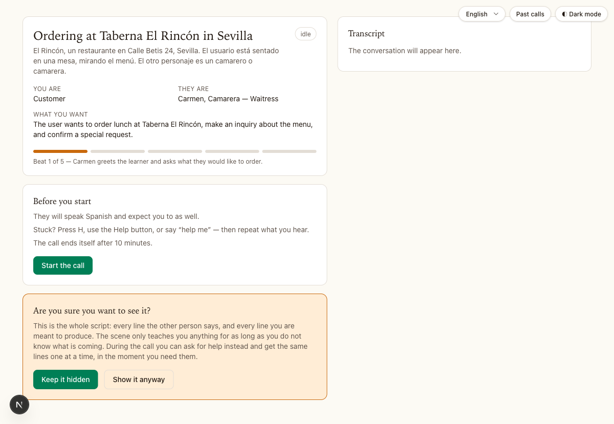

# CallMode

Practise a real conversation in the language you are learning, out loud, with an
ElevenLabs voice agent playing the other person.

Pick a situation or describe one. The agent plays the pharmacist, the hiring
manager, the landlord — and works through the scene beat by beat, asking and then
waiting. When you are stuck, you ask for help: it gives you one line in the target
language, **you say it back**, and the scene carries on. At the end you get a
debrief of the lines you were given, the ones you missed, and what to fix.

## Watch it

26 seconds — English interface, learning Polish, one situation from the library,
straight through to the brief. Silent, and it stops where the microphone would
take over.

<video src="https://github.com/agolikov/voice-agent-poc/raw/main/docs/media/callmode-walkthrough.mp4" poster="https://github.com/agolikov/voice-agent-poc/raw/main/docs/media/callmode-home.png" controls muted playsinline width="100%"></video>

_No player? [Download the walkthrough](docs/media/callmode-walkthrough.mp4)._

## The help loop

This is what makes it different from talking to a chatbot.

1. Press <kbd>H</kbd>, hit **Help me say this**, or say your trigger word.
2. The model answer for this beat appears on screen and the agent says it.
3. The agent asks you to repeat it, and stops. It will not continue for you.
4. It grades your repetition, and after two misses corrects you, logs it and
   moves on — the scene never deadlocks on a misheard word.

The whole script is also available before the call, collapsed, behind one
confirmation. It is a spoiler in the strict sense — reading the line replaces
producing it with recognising it — so it asks whether you are sure, and it is
not offered once the call is live. It exists because a learner too nervous to
press the button does not practise at all.

## What you can practise

- **Situations from the library** — the pharmacy, the flat viewing, the
  interview. They ship language-neutral, so every one of them works in whatever
  language you are learning.
- **Anything you describe** — type the situation you are actually walking into
  tomorrow and it is written for you.
- **A photo of the thing in front of you** — the menu, the timetable, the letter
  from the tax office. The scene is built from what is really in it: the real
  dishes at the real prices, the platform number that is really printed there.

## Everything is a per-run setting

Target and native language, level, how much help a hint gives, repeat policy and
how strict it is, correction style, speaking pace, whether the agent may ever use
your language, and a hard time limit. Change any of them and run the same
situation again — it plays differently. Settings live in your browser and persist
between runs.

Three hint modes:

| Mode | What you hear | What you see |
| --- | --- | --- |
| `target-only` | the line, target language only | the line |
| `target-plus-translation` | the line, target language only | the line and its meaning |
| `native-cue-first` | one sentence of your language, then the line | the line and its meaning |

## After the call

The debrief is ready the moment you hang up: every line you were given, every
repetition and how it scored, and each correction filed under grammar,
vocabulary, word order, register or pronunciation. Past runs are listed at
`/history`, newest first, with the transcript and — when a recording was kept —
the audio.

## What it does not do

Pronunciation is not scored. Speech recognition returns text, not phonemes, so
the repeat gate judges phrasing and word choice and is blind to accent.

## Cost

Voice minutes run about $0.08–0.10 a minute, so a ten-minute session is roughly a
dollar. Each run has a hard time limit, and the agent knows it, so it steers to a
close rather than being cut off mid-sentence.

---

**Running or hacking on it?** Everything technical — setup, the ElevenLabs agent,
architecture, the models, self-hosting, tests — is in
[TECHNICAL.md](TECHNICAL.md).
