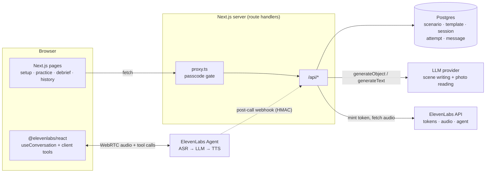

# How CallMode works

CallMode is a Next.js app for practising a spoken conversation in a foreign
language. The learner picks or describes a situation (a pharmacy, a flat viewing,
a photo of a menu). An LLM writes it into a scene in the target language, and an
ElevenLabs voice agent plays the other person over WebRTC. When the learner is
stuck they ask for help. The agent shows a line, says it, waits for the learner
to say it back and grades the attempt. Each hint, attempt and correction is
logged as it happens, so the debrief is ready as soon as the call ends.

These pages explain how the app works internally. For what the product is and
why, see the [root README](../README.md). For setup and the main design
decisions, see [TECHNICAL.md](../TECHNICAL.md).

## The big picture

Each run has three stages, handled by different systems:

| Stage | What happens | Who does it |
| --- | --- | --- |
| **Write the scene** | A language-neutral *template* is turned into a concrete *scenario* in the target language and level, then cached. | Server → LLM via the Vercel AI SDK |
| **Run the call** | The browser joins a realtime voice session. The agent plays the scene and updates the screen through five client tools. | Browser ↔ ElevenLabs Agent |
| **Keep the record** | Each tool call and transcript line is POSTed to the server and stored. The debrief page reads those rows. | Browser → Server → Postgres |

## One run, end to end

1. **Setup** (`/`): a four-step wizard collects the target language, native
   language, CEFR level, the situation and the per-run settings. Settings are
   stored in `localStorage`.
2. **Prepare** (`POST /api/scenarios/prepare`): the server looks up a cached
   realization of the template for that language and level. On a miss it asks
   the LLM to write one, then redirects to `/practice/<scenarioId>`.
3. **Open** (`POST /api/sessions`): when the learner presses *Start call*, the
   server creates a `session` row and builds the ElevenLabs dynamic variables and
   overrides. The browser then gets a short-lived WebRTC token from
   `POST /api/conversation-token` and connects.
4. **Talk**: the agent works through the scene's beats. Each time it calls
   `showHint`, `recordAttempt`, `advanceBeat`, `logMistake` or `endScenario`,
   the browser updates the UI and POSTs a row to the server.
5. **Debrief** (`/debrief/<sessionId>`): a server-rendered page reads the
   session's attempts and messages from Postgres. If ElevenLabs' post-call
   webhook arrives later, it adds analysis and model timing.

## Documentation map

| Page | Read it to understand |
| --- | --- |
| [User journey](user-journey.md) | Every screen, what each control does, and which code is behind it |
| [Architecture](architecture.md) | Layers, directory map, what runs where, and the design rules the code follows |
| [Scenarios](scenarios.md) | Templates, writing a scene from a description or a photo, realization, caching |
| [The voice call](voice-call.md) | The agent, dynamic variables, the help loop, client tools, turn-taking, ending a call |
| [Data model](data-model.md) | The five tables, who writes each column, how the debrief is derived |
| [API reference](api-reference.md) | Every route: method, body, response, caller |
| [Access and security](access-and-security.md) | Passcode gate, cookie format, webhook signatures, where secrets live |
| [Configuration and operations](configuration-and-operations.md) | Environment variables, agent-as-code workflow, scripts, deployment, tests |

## Glossary

| Term | Meaning |
| --- | --- |
| **Template** | A situation without a language: roles, goal, beat intents, vocabulary *concepts*. Curated ones live in `src/data/templates/*.json`. Generated ones are stored in the `template` table. |
| **Scenario** | A template *realized* into one target language, native language and CEFR level, with real lines. Stored in the `scenario` table and addressed by its id in `/practice/<id>`. |
| **Realization** | The LLM step that turns a template into a scenario. It is cached by a hash of the template and the language and level settings. |
| **Beat** | One exchange in the scene. It has an `intent` (what the agent pushes for), an `agentCue`, a `modelAnswer` (the line the learner is given on help), its translation, key phrases and success criteria. |
| **Model answer** | The single target-language line the learner is asked to repeat when they ask for help on a beat. |
| **Session** | One run of one scenario. It has its own settings, outcome and (optionally) ElevenLabs conversation id. |
| **Attempt** | One logged event in a session: a `hint`, an `answer`, a `repeat` or a `mistake`. The debrief is built from these. |
| **Message** | One transcript line (agent or learner), with timing data. |
| **Client tool** | A function the ElevenLabs agent calls that runs in the browser rather than on ElevenLabs' side. |

## Known limitations

These are deliberate, or follow from what the platform can do.

- **One scene per call.** The agent cannot switch situations mid-call. If the
  learner asks to, it tells them to end the call and pick a new one.
- **Pronunciation is not scored.** ASR returns text, so the repeat check sees
  words, not sounds.
- **No accounts.** Every visitor behind the passcode is the same anonymous
  user. History, sessions and saved situations are shared by everyone.
- **The webhook is optional.** Without a public URL it never arrives, and the
  debrief shows no model TTFB and no post-call analysis. Everything else works.
- **Older scenes don't record their native language.** A call always runs in
  the target language and level its scene was written in. Scenes realized
  before the native language was stored on them fall back to the learner's
  current native language for the agent's cue and language policy.
