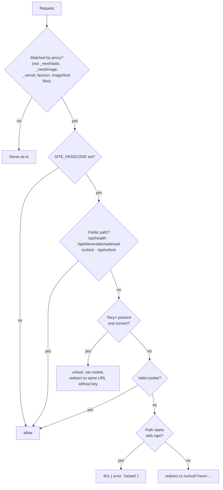

# Access and security

CallMode has no user accounts. It protects two things: the **credentials** it
holds (voice minutes and model tokens cost money), and **access to the site**,
through an optional shared passcode. This page explains how both work. For the
reasoning behind them, see [TECHNICAL.md → Site access](../TECHNICAL.md#site-access).

## Where secrets live

| Secret | Lives | The browser gets |
| --- | --- | --- |
| `ELEVENLABS_API_KEY` | Server env only | A short-lived WebRTC conversation token from `POST /api/conversation-token` |
| `ELEVENLABS_AGENT_ID` | Server env only | Nothing: the token is already bound to the agent |
| `AI_API_KEY` | Server env only | Nothing. The browser asks for a scene and receives the result |
| `ELEVENLABS_WEBHOOK_SECRET` | Server env only | Nothing |
| `SITE_PASSCODE` | Server env only | An HMAC-signed, HTTP-only cookie that does not contain the passcode |

The browser can neither choose a model nor change the agent's prompt. Prompt
override is disabled in the agent config, and only the dynamic variables built
on the server reach it.

## The passcode gate

Three files:
- [`src/proxy.ts`](../src/proxy.ts) runs on every matched request and applies
  the decision.
- [`src/lib/auth/decide.ts`](../src/lib/auth/decide.ts) contains
  `decideAccess()`, a pure function that is unit-tested without a request.
- [`src/lib/auth/gate.ts`](../src/lib/auth/gate.ts) mints and verifies tokens
  and compares passcodes.



### Rules
- **The gate is off by default.** With `SITE_PASSCODE` unset, every request is
  allowed. That suits local development.
- **Pages redirect, APIs refuse.** A page request without a cookie is sent to
  `/unlock?next=<path>`. An API request gets a `401`, since `fetch` cannot
  usefully follow a redirect to an HTML page.
- **`?key=<passcode>` gives a one-click link.** It sets the cookie and
  redirects to the same URL with `key` removed. `key` is removed even when it
  is wrong, so the code never stays in the address bar, history, `Referer`
  headers or the `next` parameter. A correct key does appear once in the
  server's access log.
- **Always-public paths:** `/api/health` (a liveness probe sends no cookie, and
  a 401 would restart a healthy container), `/api/elevenlabs/webhook` (HMAC
  authenticated, see below), and the unlock page and endpoint themselves.
- **Static assets are not gated** (see the matcher in `proxy.ts`), so the
  unlock page can load its CSS and fonts. `_vercel` is excluded so Vercel
  Analytics keeps working.
- **No open redirect.** `safeNextPath()` only accepts paths that start with `/`
  and not `//`. Anything else becomes `/`.
- **Redirects use the visitor's hostname.** `visitorOrigin()` prefers
  `x-forwarded-host` and the first `x-forwarded-proto`, so a visitor who came
  through a tunnel or reverse proxy is not redirected to an internal hostname.

### The cookie

| Property | Value |
| --- | --- |
| Name | `callmode-access` |
| Value | `<expiresAt>.<hex HMAC-SHA256(key = passcode, msg = "v1.<expiresAt>")>` |
| Lifetime | 30 days, enforced by the cookie's `Max-Age` **and** by the signed `expiresAt` (a copied value still expires) |
| Flags | `HttpOnly`, `SameSite=Lax`, `Path=/`, and `Secure` in production |

The passcode is the HMAC key, so **changing `SITE_PASSCODE` invalidates every
cookie already issued**, and everyone is locked out immediately.

Comparisons are timing-safe. Passcodes are SHA-256 hashed before
`timingSafeEqual`, so the buffers always have equal length and the timing does
not reveal the passcode's length. Token signatures are compared as hex buffers
of equal length.

### Throttling
`POST /api/unlock` allows **10 attempts per 10 minutes per client** (first
`x-forwarded-for` entry, or `x-real-ip`) and returns `429` after that. The
counter is an in-memory `Map` per server instance. That is enough for a single
container, but several instances would need shared state.

### Generating a passcode
```sh
SITE_PASSCODE=$(openssl rand -hex 12)
```
Use hex rather than base64: in a `?key=` link, base64's `+` decodes to a space.

## Webhook signature verification

[`src/lib/webhook/verify.ts`](../src/lib/webhook/verify.ts) verifies
ElevenLabs post-call deliveries:

1. Parse the `ElevenLabs-Signature` header: `t=<unix seconds>,v0=<hex>`. If
   either part is missing, the result is `malformed`.
2. Compute `HMAC-SHA256(ELEVENLABS_WEBHOOK_SECRET, "<t>.<raw body>")`.
3. Compare in constant time. If the values differ, the result is `mismatch`.
4. **Only then** check freshness: `|now − t| > 30 min` returns `stale`.
   Checking after the signature means an unsigned request cannot learn
   anything from how quickly it was refused.

The timestamp is inside the signed payload, so an old delivery cannot be
re-sent with a fresh timestamp, and verbatim replays are rejected once they are
older than 30 minutes. The tests cover tampered, wrong-secret, replayed and
malformed deliveries.

## Input limits

| Input | Limit |
| --- | --- |
| Situation description | ≤ 500 characters |
| Photo notes (`imageContext`) | ≤ 4000 characters |
| Photo | `data:` URL. JPEG, PNG, WebP or GIF. Decoded size ≤ about 6 MB. The browser already shrinks it to ≤ 1280 px |
| Help trigger | 1–40 characters |
| Call length | 1–60 minutes (browser timer). The agent has a 3600 s ceiling |
| ASR keywords | ≤ 50 |

## What is *not* protected

- **There is no per-user authorisation.** Anyone with the passcode can list,
  read, download and delete every session and edit every saved situation.
- **Session ids are the only "secret" in a debrief URL**, and they are only
  meaningful behind the gate.
- **Call audio is kept by ElevenLabs** (`record_voice: true`, retention `-1`).
  Deleting a session in CallMode does not delete the recording on ElevenLabs'
  side.
