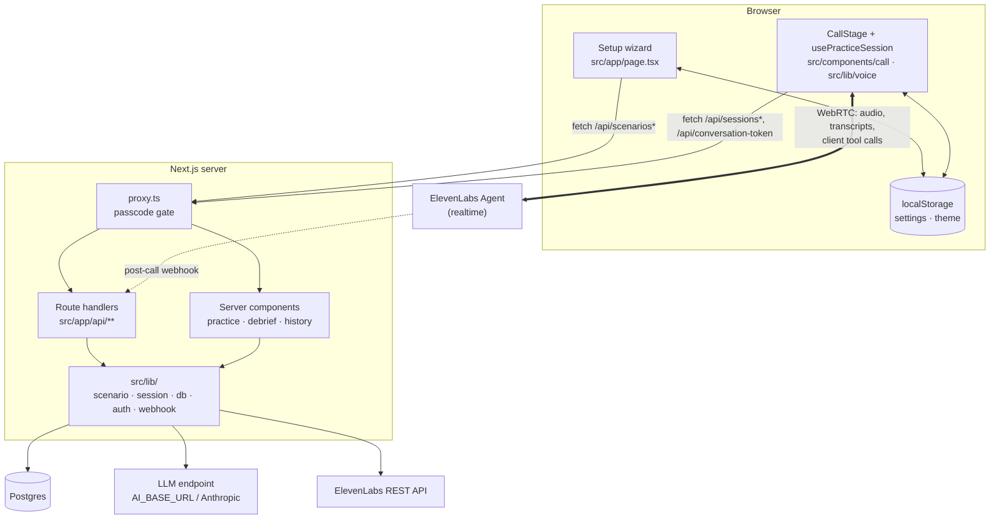
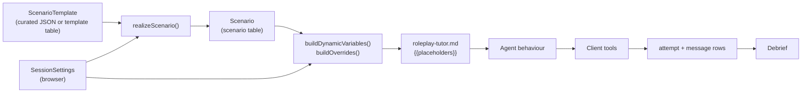

# Architecture

## Stack

| Layer | Technology |
| --- | --- |
| Web app | Next.js 16 App Router, React 19, Tailwind 4. Node ≥ 22, pnpm |
| Voice | ElevenLabs Agents over WebRTC (`@elevenlabs/react` in the browser, `@elevenlabs/elevenlabs-js` on the server) |
| Scene writing | Vercel AI SDK (`ai`): `generateObject` against Zod schemas, using an OpenAI-compatible endpoint or Anthropic |
| Storage | Postgres via Drizzle ORM and `node-postgres` |
| Validation | Zod 4. The same schemas validate LLM output, request bodies and stored JSON |
| Access | One shared passcode, enforced in `src/proxy.ts` (the Next 16 replacement for `middleware.ts`) |
| Analytics | `@vercel/analytics` |

> This repo runs a Next.js version with breaking changes compared with older
> releases. For example, `proxy.ts` replaces middleware and route `params` are
> `Promise`s. After `pnpm install`, the matching guide is in
> `node_modules/next/dist/docs/` (see `AGENTS.md`).

## What runs where



### Browser responsibilities
- Collect and store settings (`localStorage`, key `callmode.settings`).
- Shrink photos before upload (`src/lib/image/downscale.ts`).
- Dictate situation descriptions with the Web Speech API
  (`src/lib/speech/use-dictation.ts`).
- Hold the live call. `usePracticeSession` wraps `useConversation`, registers
  the client tools, runs the time-limit timer, sends `[HELP]` and handles
  *Done speaking*.
- Log each transcript line and tool call to the server as it happens.

### Server responsibilities
- Gate every request when `SITE_PASSCODE` is set.
- Hold every secret: the ElevenLabs API key, the LLM key, the webhook secret
  and the passcode. The browser only ever receives a short-lived WebRTC
  conversation token.
- Write scenes: read photos, design templates, realize templates and cache them.
- Build the per-call **dynamic variables** and **overrides**, the only
  interface between app data and the agent's prompt.
- Store sessions, attempts and messages, and render the debrief and history.
- Verify and apply the post-call webhook.

### ElevenLabs responsibilities
- Speech recognition (`scribe_realtime`), turn-taking, the conversation LLM
  (`gemini-2.5-flash` at temperature 0.3) and speech synthesis
  (`eleven_flash_v2_5`), all inside one realtime session.
- Deciding *when* to call each client tool, as instructed by the prompt in
  `agent/prompts/roleplay-tutor.md`.
- Recording audio and, after the call, sending transcript metrics and
  evaluation results to the webhook.

## Directory map

```
agent/
  prompts/roleplay-tutor.md      The agent's system prompt (edit this, not the JSON)
  tool_configs/*.json            The five client tool definitions
  agent_configs/roleplay-tutor.json  Generated by build.mjs: the full agent config
  build.mjs                      prompt.md + tool ids (tools.json) → agent config
agents.json, tools.json          ElevenLabs CLI registries: names → platform ids

src/
  proxy.ts                       Next 16 request proxy: runs the passcode gate
  app/
    page.tsx                     Setup wizard (client component)
    practice/[scenarioId]/       Server page loads scenario → client call stage
    debrief/[sessionId]/         Server-rendered debrief
    history/                     Server-rendered list of past sessions
    unlock/                      Passcode form
    api/                         Route handlers; see api-reference.md
  components/
    setup/                       Wizard steps, picker, composer, editor, settings
    call/                        Call stage, hint card, beat tracker, transcript, script preview
    history/                     Delete control
    ui.tsx                       Button, Card, Select, Label primitives
  data/templates/*.json          13 curated, language-neutral situation templates
  lib/
    scenario/                    Schemas, template library, prompts, generation, vision, model provider
    session/                     Settings schema, dynamic variables, similarity, recommended terms
    voice/                       usePracticeSession hook and shared types
    db/                          Drizzle schema, pool, every query
    auth/                        Passcode gate: token mint/verify, access decision
    webhook/                     ElevenLabs HMAC signature verification
    i18n/                        UI locales (en/pl/ru), messages, curated template copy
    image/, speech/              Photo downscaling, dictation

drizzle/                         Generated SQL migrations + snapshots
scripts/                         migrate.mjs, seed-demo.mjs, import-sqlite.mjs
Dockerfile                       Self-host image: migrate on start, then next start
```

## How the pieces connect



The two inputs are a **template** (what situation) and **settings** (which
language, what level, how much help). Realization combines them into a
**scenario**. At call time, the scenario and the settings are rendered into
dynamic variables that fill the placeholders in the agent's prompt. The agent's
tool calls produce the log rows, and the debrief reads those rows.

## Design rules the code follows

These rules are stated in comments throughout the code and explain most of its
structure.

1. **The model fills a shape, it does not write prose.** Every LLM call that
   produces data uses `generateObject` with a Zod schema, and the result is
   validated again with the same schema. IDs, slugs and beat structure are
   assigned by the app, never invented by the model (`generatedScenarioSchema`
   and `mergeRealization`).
2. **Structure comes from the template, words come from the model.**
   Realization returns only the language-bearing fields. `mergeRealization`
   takes ids, intents, roles and order from the template and drops any beat the
   model failed to return, rather than inventing one. A beat without a model
   answer would break the help loop.
3. **Pay for a scene once.** Realizations are cached by
   `sha256(template, targetLanguage, nativeLanguage, cefrLevel)`. Running the
   same situation again at the same settings costs no model call.
4. **The prompt contract lives in one place.** `buildDynamicVariables` is the
   only producer of `{{placeholders}}`. A test checks that every placeholder in
   the prompt has a value, because an unfilled placeholder reaches the model as
   literal text and its instruction is silently lost.
5. **The debrief does not depend on the webhook.** Each judged turn is logged
   live through client tools. The webhook only adds data. Local development
   with no public URL loses nothing important.
6. **Logging must never break the call.** Client tool handlers log with a
   fire-and-forget `fetch(..., { keepalive: true }).catch(() => undefined)`. A
   lost log line costs one debrief row. An exception thrown inside a tool
   handler would cost the learner the conversation.
7. **Deterministic paths for important input.** The help button and the
   <kbd>H</kbd> key send a literal `[HELP]` text message that bypasses ASR. The
   spoken trigger is a fallback, and its words are boosted as ASR keywords.
8. **Show what the model read before building on it.** A photo is read once,
   and the text is shown to the learner for correction before a scene is
   written from it. Only that text is stored, never the image.
9. **No foreign keys, explicit deletes.** Tables reference each other by id
   without declared constraints. `deleteSession` removes children in a
   transaction and keeps the shared scenario row.
10. **The gate is opt-in.** Leaving `SITE_PASSCODE` unset leaves the site open
    for local development. The gate turns on when it is configured, so nobody
    has to remember to turn it off.

## Rendering model

| Route | Kind | Why |
| --- | --- | --- |
| `/` | Client component | Needs `localStorage`, interactive wizard state and file and microphone APIs |
| `/practice/[scenarioId]` | Server page → client `PracticeClient` | The scenario is loaded on the server (404 if missing). Settings and the call are client-only |
| `/debrief/[sessionId]` | Server component | Reads the DB directly. No client state needed |
| `/history` | Server component (`await connection()` forces dynamic rendering) | Always lists fresh rows |
| `/unlock` | Server component (`force-dynamic`) + client form | Reads the cookie to skip the form if already unlocked |

The layout reads the UI locale from a cookie on the server
(`getServerLocale`), wraps the app in `I18nProvider` and renders
`GlobalControls` and Vercel `Analytics`.

## Database connection

`src/lib/db/client.ts` creates one `pg.Pool` with `max = DATABASE_POOL_MAX`
(default 5). In development the pool is stored on `globalThis` so hot reloads do
not leak connections. `pg` is listed in `serverExternalPackages` in
`next.config.ts`. `next build` evaluates the module but does not connect,
because `node-postgres` connects lazily, so a build needs no database.
