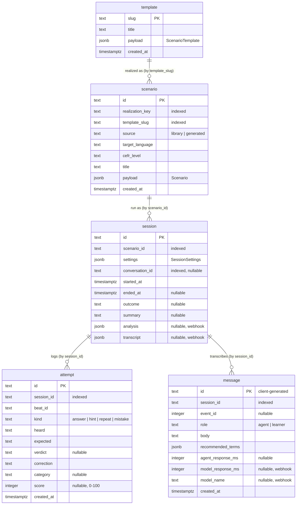

# Data model

State lives in Postgres and is accessed through Drizzle
([`src/lib/db/schema.ts`](../src/lib/db/schema.ts),
[`src/lib/db/queries.ts`](../src/lib/db/queries.ts)). Column names are
`snake_case` in SQL and `camelCase` in TypeScript (`casing: "snake_case"`).
The only browser-side state is the learner's settings and theme in
`localStorage`, and the UI-language cookie.

## Tables



> **No foreign keys are declared.** The relationships above are logical. They
> are joined by id in queries but not enforced by the database. Curated
> templates are not in the `template` table at all: they are JSON files, so a
> `scenario.template_slug` may point to a file rather than a row.

### `template`
User-made situations (`source: "generated"`), so they can be replayed and
edited.

| Written by | Read by |
| --- | --- |
| `POST /api/scenarios/generate` (insert under a free slug, see below), `PATCH /api/templates/:slug` (upsert on `slug`) | `GET /api/scenarios` (picker), `POST /api/scenarios/prepare` (after curated files), `GET /api/templates/:slug` |

A new situation's slug comes from its generated title, so it can clash with a
saved or curated one. `saveNewTemplate()` tries `slug`, `slug-2`, `slug-3` and so
on (and finally a random suffix), skipping curated slugs. It claims each
candidate with `INSERT … ON CONFLICT DO NOTHING`, so neither an existing
situation nor a concurrent generation with the same title gets overwritten.

### `scenario`
A realized scene: one template at one target language, native language and
level. It works as a **cache**. `realization_key` =
`sha256([template, targetLanguage, nativeLanguage, cefrLevel])[:32]`.

| Written by | Read by |
| --- | --- |
| `POST /api/scenarios/prepare` on a cache miss (`ON CONFLICT DO NOTHING`) | `/prepare` (cache lookup by key), `/practice/:id`, `POST /api/sessions`, debrief, history (title via left join) |

A stored `payload` that no longer parses as `Scenario` is treated as missing:
`/prepare` realizes the scene again and the practice page returns a 404.

### `session`
One run of one scenario.

| Column | Set when | By |
| --- | --- | --- |
| `id`, `scenario_id`, `settings`, `started_at` | The learner presses *Start the call* | `POST /api/sessions` |
| `conversation_id` | The WebRTC session connects | `POST /api/sessions/:id/conversation` |
| `ended_at`, `outcome`, `summary` | The call ends via `endScenario`, the End button or the timer | `POST /api/sessions/:id/end` |
| `analysis`, `transcript` | ElevenLabs delivers the post-call webhook | `POST /api/elevenlabs/webhook` |

`outcome` is one of `goal-achieved`, `partial`, `abandoned` or `out-of-time`. A
`null` value means the call never ended cleanly (connect failure, dropped
connection, closed tab) and shows as *Unfinished*.

`settings` is a snapshot of the `SessionSettings` used for this run, with the
target language, level and (if recorded) native language pinned to the
scenario's (see `settingsForScenario()`).

### `attempt`
The **event log the debrief is built from**. Rows arrive live from client tool
handlers via `POST /api/sessions/:id/attempts`.

| Client tool | `kind` | `beat_id` | `heard` | `expected` | `verdict` | `correction` | `category` |
| --- | --- | --- | --- | --- | --- | --- | --- |
| `showHint` | `hint` | the hint's beat | — | the model answer | — | — | — |
| `recordAttempt`, verdict `repeated` / `missed`, or `partial` while a hint for that beat is open | `repeat` | from tool | what the learner said | the model answer | verdict | from tool | — |
| `recordAttempt`, verdict `answered`, or `partial` with no open hint for that beat | `answer` | from tool | what the learner said | what the agent hoped for | verdict | from tool | — |
| `logMistake` | `mistake` | current beat in the browser | the wrong form | — | — | the right form | `grammar` · `vocabulary` · `word-order` · `register` · `pronunciation` |

`score` is computed on the server at insert time: `round(similarity(heard,
expected) × 100)`, or `null` if either side is empty.

### `message`
A durable, ordered copy of the transcript, written live by the browser via
`POST /api/sessions/:id/messages`. The primary key is the id the browser
generated, and inserts use `ON CONFLICT DO UPDATE`, so a retried POST does not
create a duplicate row.

| Column | Meaning |
| --- | --- |
| `event_id` | The ElevenLabs SDK event id. Used to match webhook metrics to turns |
| `recommended_terms` | Which of the scene's vocabulary terms or key phrases a learner line used |
| `agent_response_ms` | Agent lines only: from the learner's transcript arriving to the agent's reply arriving, measured in the browser |
| `model_response_ms`, `model_name` | Agent lines only: the LLM time to first byte and model name, added later from the webhook |

## Similarity score

[`src/lib/session/similarity.ts`](../src/lib/session/similarity.ts):

1. Normalize both strings: NFD, strip diacritics, lowercase, replace
   punctuation with spaces, collapse whitespace. Diacritics are removed because
   ASR handles them inconsistently, so a missing accent is more often a
   transcription artefact than a learner error.
2. Tokenize on spaces.
3. Compute the Levenshtein distance over **tokens** (words), not characters.
4. `similarity = max(0, 1 − distance / max(len(a), len(b)))`.

The score is **informational**. Whether the scene moves on is the agent's
judgement, because only the agent knows whether a different word was still
correct. `toleranceThreshold` (`strict` 0.95, `normal` 0.7, `lenient` 0.5) and
`meetsTolerance()` exist and are tested, but nothing calls them at runtime.

## How the debrief is derived

`getDebrief(sessionId)` loads the session row, its attempts (ordered by
`created_at`), its messages (ordered by `created_at`), the parsed settings and
the scenario. The debrief page then computes:

```ts
answers  = attempts.filter(kind === "answer")              // "Turns you answered"
hints    = attempts.filter(kind === "hint")                // "Hints used"
repeats  = attempts.filter(kind === "repeat")              // "Lines you were given"
repeated = repeats.filter(verdict === "repeated")          // "Lines repeated"
missed   = repeats.filter(verdict === "missed")            // "Lines missed"
mistakes = attempts.filter(kind === "mistake")             // "What to fix", grouped by category
```

No LLM call is involved and the webhook is not required.

## Webhook enrichment

`POST /api/elevenlabs/webhook` → `attachAnalysis(conversationId, analysis,
transcript)`:

1. Find the session by `conversation_id`. If none matches, it returns
   `{ matched: false }` and does nothing else.
2. Store `analysis` (evaluation criteria and data-collection results) and the
   raw `transcript` on the session.
3. Extract per-agent-turn metrics with `postCallAgentTurns(transcript)`
   ([`post-call-transcript.ts`](../src/lib/session/post-call-transcript.ts)):
   - the LLM TTFB, preferring `convai_llm_service_ttfb`, then
     `llm_service_ttfb`, then `llm_ttfb`, then any metric name containing
     `llm` and `ttfb` or `latency`, converted from seconds to milliseconds;
   - the producing model name.
4. Match each metric to a stored agent message by `event_id`, falling back to
   its position among agent messages, and update `model_response_ms` and
   `model_name`.

## Deleting a session

`DELETE /api/sessions/:id` → `deleteSession()` runs in one transaction. It
deletes the `message` rows, then the `attempt` rows, then the `session` row,
and returns `false` (→ 404) if the session did not exist. The `scenario` row
is **kept**, because it is a cached realization other sessions may point at,
and deleting it would make the next run pay for it again. Audio held by
ElevenLabs is not deleted.

## Migrations and seed data

- **Schema source**: `src/lib/db/schema.ts`. **Migrations**: `drizzle/*.sql`,
  generated with `drizzle-kit` (`drizzle.config.ts`).
- `pnpm db:migrate` → [`scripts/migrate.mjs`](../scripts/migrate.mjs) applies
  the committed migrations using Drizzle's runtime migrator. It needs no
  TypeScript and no `drizzle-kit`, which is why the Docker container can run it
  on every start.
- `pnpm db:push`: pushes the schema directly (development only).
- `pnpm db:studio`: Drizzle Studio.
- `pnpm db:seed` → [`scripts/seed-demo.mjs`](../scripts/seed-demo.mjs) inserts:
  - an editable saved situation, *Chasing a late parcel*
    (`late-parcel-demo`);
  - a hand-written Spanish pharmacy scene, `demo-pharmacy-es`;
  - a finished session, `demo-session`, with attempts and messages.

  This makes `/practice/demo-pharmacy-es` and `/debrief/demo-session` viewable
  with no API keys.
- `pnpm db:import-sqlite <path>` →
  [`scripts/import-sqlite.mjs`](../scripts/import-sqlite.mjs) is a one-off
  idempotent import from the old SQLite database.
