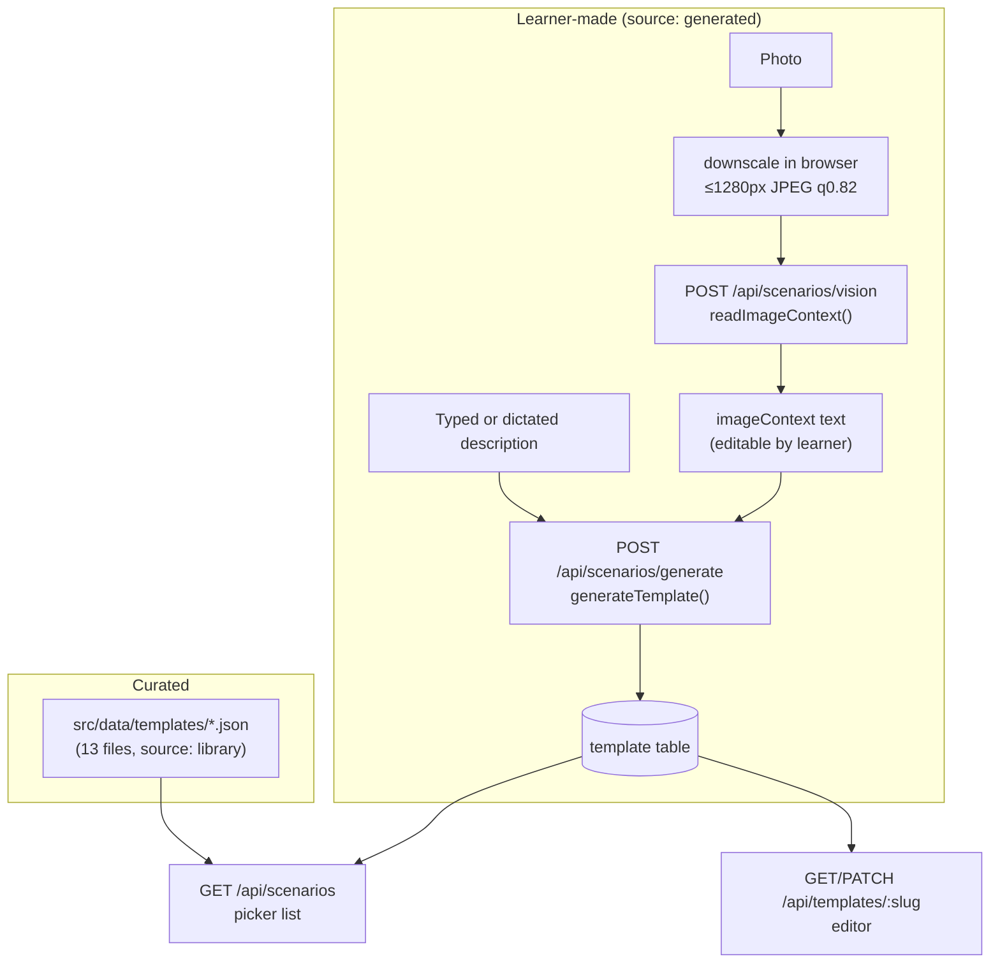
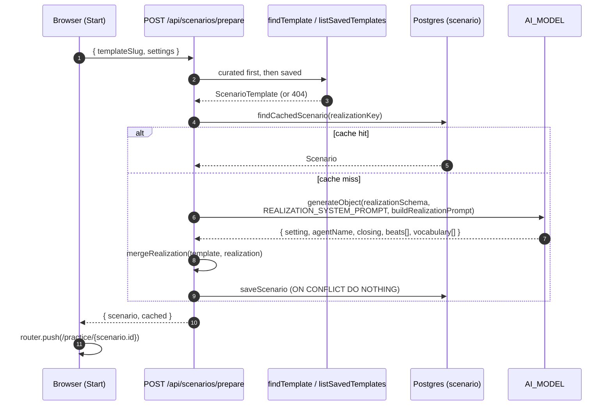

# Scenarios: templates, generation and realization

A scene gets to the agent in two steps:

1. **Template**: a situation with no language. It defines the roles, the goal,
   the beat intents and the vocabulary *concepts*, in English or the UI language.
2. **Scenario**: a template *realized* for one target language, native language
   and CEFR level, with the actual lines.

The split exists because the situation design is the part worth curating by
hand, not "how to say *I'd like to return this* in Spanish". One curated template
works for every language without writing it 17 times, and user-described
situations go through the same realization path.

Code: [`src/lib/scenario/`](../src/lib/scenario/).

## Shapes

All shapes are Zod schemas in
[`schema.ts`](../src/lib/scenario/schema.ts). The same schema is passed to
the LLM (`generateObject`) and used to validate the result.

### `ScenarioTemplate`

| Field | Notes |
| --- | --- |
| `slug` | kebab-case, primary key for saved templates |
| `title`, `summary` | Shown in the picker |
| `source` | `library` (curated) or `generated` |
| `setting` | One line of place and time |
| `agentRole` | `{ name, role, persona, voiceId? }`. The persona should say the character does not fill the learner's silences |
| `userRole` | `{ role, goal }` |
| `beats[]` | `{ id, intent, successCriteria }`. `intent` is written from the **agent's** side: what it must get the learner to say |
| `vocabularyConcepts[]` | English concepts. Realization translates them |
| `imageContext` | What an attached photo showed, as text. Empty if there was no photo |
| `closing` | Stage direction for wrapping up |
| `successCriteria[]` | What a good run looks like |
| `suggestedLevel` | Sorting hint, not a gate |

### `Scenario` (realized)

| Field | Notes |
| --- | --- |
| `id` | UUID, used in `/practice/<id>` |
| `slug`, `title`, `source` | From the template |
| `targetLanguage`, `nativeLanguage`, `cefrLevel` | From settings at realization time. A call always runs in these, whatever the learner's settings are now. `nativeLanguage` is optional, because scenes written before it was recorded don't have it |
| `setting` | Rewritten for a place where the target language is spoken (still English, because it is stage direction) |
| `agentRole` | Template role with `name` replaced by the realized `agentName` |
| `userRole` | From the template |
| `beats[]` | `{ id, index, intent, successCriteria, agentCue, modelAnswer, modelAnswerTranslation, keyPhrases[] }` |
| `vocabulary[]` | `{ term, translation, note }` |
| `closing`, `successCriteria` | |

A **beat** is one exchange. `agentCue` is how the agent might open it, and
`modelAnswer` is the line the **learner** is given if they ask for help. If the
two could be swapped, the beat is written wrong, and the prompt tells the model
so in those words.

## Where templates come from



### Curated templates
`loadTemplates()` ([`library.ts`](../src/lib/scenario/library.ts)) reads every
JSON file in `process.cwd()/src/data/templates` **at request time**, validates
each one and sorts them by title. A malformed file throws an error rather than
producing a broken scene mid-call. This is also why the Docker image ships the
`src/` tree and does not use a standalone build.

To add one:
1. Drop a JSON file matching `scenarioTemplateSchema` with
   `"source": "library"` into `src/data/templates/`.
2. Optionally add card artwork in `public/images/scenarios/` and register it in
   [`scenario-images.ts`](../src/components/setup/scenario-images.ts).
3. Optionally add Polish and Russian title, summary and goal copy in
   [`template-copy.ts`](../src/lib/i18n/template-copy.ts). Without it the
   English copy is shown.

### From a description
`POST /api/scenarios/generate` → `generateTemplate()`
([`generate.ts`](../src/lib/scenario/generate.ts)):

- **Model**: `getModel()`, the `AI_MODEL` setting.
- **Schema**: `scenarioTemplateSchema` without `slug`, `source` and
  `imageContext`, which the app sets itself.
- **System prompt**: `templateSystemPrompt(uiLocale)`
  ([`prompt.ts`](../src/lib/scenario/prompt.ts)). Its rules:
  - The other character wants something too.
  - Something goes mildly wrong once.
  - Each beat forces one speech act.
  - Intents are written from the character's side and never narrate both
    halves of the exchange.
  - The character never fills silences.
  - With a photo, the scene happens where the photo was taken.
  - Authoring fields are written in the UI language.
- **User prompt**: `buildTemplatePrompt()`. It contains the description, or
  "build it from the photo" if there is none, the photo notes, the level, the
  beat-count range for the chosen preset and a request for 8–12 vocabulary
  concepts.
- **Afterwards**: the slug is slugified from the title (with a random suffix if
  that yields nothing useful), `source` is set to `generated`, and
  `imageContext` is copied onto the template. `saveNewTemplate()` inserts it into
  the `template` table under the first free slug (`slug`, `slug-2`, … skipping
  curated slugs), so a situation with the same title as an existing one never
  overwrites it. The template is **not** realized yet.

### From a photo
1. The browser shrinks the image (`downscaleImage`) to a `data:` URL.
2. `POST /api/scenarios/vision` → `parseDataUrl()` accepts JPEG, PNG, WebP or
   GIF up to about 6 MB decoded, and rejects anything else with a 400 before
   calling the provider.
3. `readImageContext()` calls `getVisionModel()`, which is `AI_VISION_MODEL` or
   falls back to `AI_MODEL`, with `visionSystemPrompt`. The model is told to
   copy names, prices, times and codes verbatim in their printed language,
   list the relevant entries, say when something is unreadable rather than
   invent it, and stay under 250 words (`maxOutputTokens: 700`).
4. The text is shown in an editable box. The learner can fix it, and can
   submit it with or without a description.
5. Generation stores that text on the template as `imageContext`. Both the
   template prompt and the realization prompt get it as a
   *WHAT THE LEARNER PHOTOGRAPHED* section, so the model answers name the real
   dish at the real price. The image itself is never stored.

## Realization



### The cache key
```ts
realizationKey = sha256(JSON.stringify([
  template, settings.targetLanguage, settings.nativeLanguage, settings.cefrLevel,
])).slice(0, 32)
```
The **whole template** is part of the key, so:
- Changing the language, native language or level produces a new scene.
- Editing a saved situation produces a new scene the next time it is prepared.
  The old scenario row stays, and old sessions still point at it.
- Two photos of two different menus never collide, because `imageContext` is
  part of the template.
- Other settings (hint mode, repeat policy and so on) are **not** part of the
  key. They change how the agent behaves, not what the scene says.

A cached payload that no longer matches `scenarioSchema` is treated as a cache
miss, not an error, and is realized again.

### What the model is asked for
`buildRealizationPrompt()` sends the target and native language names, the
level with its guidance, the situation, the beats (ids, intents and *done when*,
in order), the vocabulary concepts and the photo notes. It asks for:

- `setting` (English) and `agentName`, localised where it is a real name.
- `closing` (English).
- For each beat id: `agentCue` (target), `modelAnswer` (target, sized by
  level), `modelAnswerTranslation` (native, meaning not word-for-word) and 2–3
  `keyPhrases` (target content words, used to boost ASR).
- `vocabulary`: each concept as a target term, a native translation and an
  optional note.

The system prompt's main rule is to write what a native speaker would say in
that place, not a translation of the English: localise names, currency,
institutions and politeness conventions.

### Model answer length by level

| Level | Guidance given to the writer |
| --- | --- |
| A1 | 3–6 words. Present tense only. The 500 most common words. No subordinate clauses |
| A2 | 5–10 words. Present and past. Everyday vocabulary. At most one clause |
| B1 | 8–14 words. Any common tense. One subordinate clause is fine |
| B2 | 10–18 words. Idiomatic where a native speaker would be. Hedging and politeness strategies |
| C1 | 12–22 words. Nuanced register, idiom and precise word choice |
| C2 | Whatever a fluent native speaker would actually say, including elision and irony |

### Merging
`mergeRealization()` builds the final `Scenario`:
- It iterates over the **template's** beats in template order and looks up the
  realized beat with the same `id`.
- A template beat with no realized match is **dropped**, not faked.
- If no beats remain, it throws an error, and `/prepare` returns a 502.
- Ids, intents, success criteria and roles come from the template. Only the
  words come from the model.
- Beats are re-indexed so `index` equals the array position.

## Model provider

[`provider.ts`](../src/lib/scenario/provider.ts) picks one provider on the
server:

| Env | Behaviour |
| --- | --- |
| `AI_BASE_URL` set | `createOpenAICompatible({ baseURL, apiKey, supportsStructuredOutputs: true })`. Works with any OpenAI-compatible endpoint. Structured outputs are forced on. Without them, a reasoning model wraps its thinking around the JSON and parsing fails |
| `AI_BASE_URL` empty | `createAnthropic({ apiKey })` |
| `AI_MODEL` | Model id for template design and realization. Defaults to `claude-sonnet-5` |
| `AI_VISION_MODEL` | Model id for photo reading. Defaults to `AI_MODEL`, which is correct for Anthropic and wrong for a text-only open-weights endpoint |
| `AI_API_KEY` | Required. Without it, scene writing throws an error |

The demo deployment uses Nebius Token Factory with `Qwen/Qwen3-32B` for writing
and `Qwen/Qwen2.5-VL-72B-Instruct` for photos.

## Editing a saved situation

`GET /api/templates/:slug` and `PATCH /api/templates/:slug` only work for
`source: "generated"` templates stored in the DB. Curated templates are
read-only files. A PATCH body is the whole template minus `slug` and `source`.
It is validated against `scenarioTemplateSchema`, then upserted. Because the
template is hashed into the realization key, the next **Start** writes a fresh
scene.
