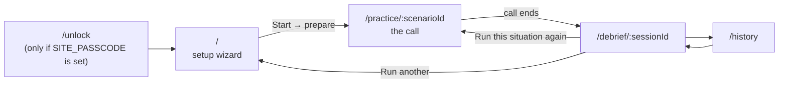

# User journey

This page covers every screen in the order a learner reaches it: what is on
screen, what each control does, and which code handles it. Paths are relative to
the repository root.

Every page has the same controls in the top-right corner
([`src/components/global-controls.tsx`](../src/components/global-controls.tsx)):

- **Interface language**: English, Polski or Русский. It is stored in the
  `callmode-locale` cookie and server components re-render on change. This is
  the language of the app's UI, not the language being practised.
- **Past calls**: a link to `/history`. It is hidden on `/unlock`.
- **Theme toggle**: light or dark, stored in `localStorage` as `callmode-theme`.
  An inline script in `layout.tsx` applies it before first paint.

---

## 1. Setup wizard: `/`

[`src/app/page.tsx`](../src/app/page.tsx) is a client component with four
steps. Each settings change is saved straight to `localStorage` under
`callmode.settings` ([`src/lib/session/store.ts`](../src/lib/session/store.ts)),
so the next run starts from the same choices.

### Step 1: What this is
[`intro.tsx`](../src/components/setup/intro.tsx). This step is static. It covers
four ideas (pick a situation, have it out loud, ask for help then say it, get the
debrief) and gives a note on microphone use and voice-minute cost.

### Step 2: Language
[`language-form.tsx`](../src/components/setup/language-form.tsx). The learner
picks:

- **Target language**: the language being practised.
- **Native language**: used for translations, the native cue in
  `native-cue-first` mode and the end-of-scene summary.
- **CEFR level**: A1 to C2. It controls how long and how complex the model
  answers are.

The language dropdown is a shortlist of 17
([`languages.ts`](../src/components/setup/languages.ts)). The rest of the app
accepts any BCP-47 tag.

### Step 3: Situation
This step has three parts:

- **Picker**
  ([`scenario-picker.tsx`](../src/components/setup/scenario-picker.tsx)):
  `GET /api/scenarios` lists the 13 curated templates and then every situation
  generated on this deployment. Curated cards have artwork, and their title and
  summary are translated for the `pl` and `ru` UI
  ([`template-copy.ts`](../src/lib/i18n/template-copy.ts)). Generated cards
  have an **Edit situation** button.
- **Composer**
  ([`scenario-composer.tsx`](../src/components/setup/scenario-composer.tsx)):
  the learner can write a new situation in three ways:
  - Type a description (3 to 500 characters), or press **Speak your situation**
    to dictate it with the browser's Web Speech API
    ([`use-dictation.ts`](../src/lib/speech/use-dictation.ts)).
  - **Add a photo.** The browser shrinks it to 1280 px on the longest edge
    (JPEG quality 0.82) and posts it to `POST /api/scenarios/vision`. The
    vision model's reading appears in an editable **What the photo shows**
    box, so a misread price can be fixed before anything is written from it.
  - Choose **How long a scene to write**: short (4–5 beats), standard (6–8) or
    long (10–12). This only affects new situations. Curated ones already have
    their beats.

  **Write it** calls `POST /api/scenarios/generate`. The new template is saved,
  the picker refreshes and the new situation is selected.
- **Editor**
  ([`scenario-editor.tsx`](../src/components/setup/scenario-editor.tsx)):
  for generated situations only. It loads `GET /api/templates/:slug` and saves
  with `PATCH`. Every template field can be edited: title, level, summary,
  setting, both roles, beats (intent and *done when*), vocabulary concepts,
  success criteria, closing and the photo notes.

**Next** stays disabled until a situation is selected.

### Step 4: How it runs
[`settings-form.tsx`](../src/components/setup/settings-form.tsx). The main
settings are always visible. The rest are under **Fine-tune the help loop**.

| Setting (UI label) | Field | Values (default first) | Effect |
| --- | --- | --- | --- |
| When you ask for help | `hintMode` | `target-only`, `target-plus-translation`, `native-cue-first` | What the agent says when giving a hint, and whether the translation is shown on screen |
| Corrections | `correctionStyle` | `in-flow`, `end-only` | Whether the agent recasts mistakes in character or saves them for the debrief |
| Speaking pace | `agentSpeechRate` | `normal` (1.0×), `slow` (0.8×) | TTS speed override |
| End the call after | `maxDurationMinutes` | 10 (1–60) | A browser timer ends the call. The agent is also told so it can wind down first |
| How long the hint is | `hintLength` | `short`, `full-sentence` | Shortest natural line or a complete sentence |
| If you cannot repeat it | `repeatPolicy` | `two-tries`, `hard-gate`, `one-try` | What the agent does after a failed repetition |
| How close is close enough | `repeatTolerance` | `normal`, `strict`, `lenient` | How strictly the agent judges a repetition |
| May they use your language? | `allowNativeLanguage` | `false`, `true` | Whether the agent may use one sentence of the native language when the learner is stuck |
| Say this out loud to ask for help | `helpTrigger` | `"help me"` | The spoken help trigger. Its words are added to the ASR keywords |

Two more fields exist in the schema without a control here: `beatCount` (set in
the composer) and `voiceId`, which has no UI. When `voiceId` is unset the agent
uses the scenario's own voice, or the agent's default.

The **Connections** panel
([`connection-checks.tsx`](../src/components/setup/connection-checks.tsx))
checks each service via `POST /api/connections`: a tiny completion against the
scene-writing model, and a read of the configured ElevenLabs agent. Use it when
scene writing hangs.

**Start** calls `POST /api/scenarios/prepare`, which writes (or fetches from
cache) the scene for this language and level, then goes to
`/practice/<scenario.id>`. The button reads *Setting the scene…* while the LLM
works. The wait happens here so that it is not spent on a live microphone.

---

## 2. Practice: `/practice/[scenarioId]`

[`page.tsx`](../src/app/practice/[scenarioId]/page.tsx) is a server component
that loads the scenario from Postgres and returns a 404 if it is missing.
[`practice-client.tsx`](../src/app/practice/[scenarioId]/practice-client.tsx)
waits until settings have been read from `localStorage`, so the call never
starts with the wrong hint mode, then renders
[`CallStage`](../src/components/call/call-stage.tsx) inside the ElevenLabs
`ConversationProvider`.

### Before the call
- The scene card shows the title and setting, **You are**, **They are**,
  **What you want** and a beat tracker (one bar per beat).
- The **Before you start** card shows the spoken language, how to ask for help
  and the time limit, plus **Start the call**.
- **See the whole conversation**
  ([`script-preview.tsx`](../src/components/call/script-preview.tsx)) shows the
  full script: the agent cue, the model answer and its translation for each
  beat. It asks for confirmation first (*Keep it hidden* or *Show it anyway*),
  because reading the lines turns producing them into recognising them. It is
  not shown once the call starts.

### During the call
**Start the call** runs the open → token → connect sequence described in
[The voice call](voice-call.md#starting-a-call). Once the call is live:

| Control | What it does |
| --- | --- |
| Status pill | *they are speaking* or *your turn*, from `conversation.isSpeaking` |
| **Help me say this (H)** | Sends the literal text message `[HELP]` to the agent. The <kbd>H</kbd> key does the same, except while typing in a field. It never goes through speech recognition |
| **Done speaking · optional** | Mutes the mic so the turn detector hears silence and ends the turn sooner. It unmutes when the agent starts speaking, or after 4 s |
| **Mute / Unmute** | Mutes or unmutes the microphone |
| **End the call** | Ends the session with outcome `abandoned` |
| Hints used | A counter of `showHint` calls |

The agent controls the rest of the screen through client tools:

- **Beat tracker**: advanced by `advanceBeat`. Finished beats are green, the
  current one is yellow.
- **Hint card**
  ([`hint-card.tsx`](../src/components/call/hint-card.tsx)): appears on
  `showHint` with the line in large type. The translation is shown unless the
  mode is `target-only`. Its colour and label follow the `recordAttempt`
  verdict: *Say this out loud* → *Got it* / *Close — listen again* / *Moving on*.
- **Transcript**
  ([`transcript.tsx`](../src/components/call/transcript.tsx)): every agent and
  learner line. A learner line is highlighted when it uses one of the scene's
  vocabulary terms or key phrases. Agent lines get two timing badges:
  - *Agent*: time from the learner's transcript arriving to the agent's reply
    arriving, measured in the browser. Green ≤ 1.5 s, yellow ≤ 3 s.
  - *Model*: the LLM's time to first byte as reported by ElevenLabs. Green
    ≤ 0.8 s, yellow ≤ 1.5 s. It shows *pending* until the post-call webhook
    fills it in.
- **Words for this scene**: the scenario's vocabulary list with translations.

When the call ends, whether the agent called `endScenario`, the learner pressed
**End the call** or the timer ran out, the page redirects to
`/debrief/<sessionId>`. It does not wait for anything, because every row is
already written.

---

## 3. Debrief: `/debrief/[sessionId]`

[`src/app/debrief/[sessionId]/page.tsx`](../src/app/debrief/[sessionId]/page.tsx)
is a server component that reads `getDebrief(sessionId)`: the session row, its
attempts and messages, and the scenario.

| Section | Built from |
| --- | --- |
| Header: outcome and summary | `session.outcome`, `session.summary` (from `endScenario`, the End button or the timer) |
| *Turns you answered* | attempts with `kind = "answer"` |
| *Hints used* | attempts with `kind = "hint"` |
| *Lines repeated* | attempts with `kind = "repeat"` and `verdict = "repeated"` |
| *Lines missed* | attempts with `kind = "repeat"` and `verdict = "missed"` |
| *Conversation* | `message` rows, rendered with the same `Transcript` component |
| *Download chat* | `GET /api/sessions/:id/transcript`: a plain-text file with timings |
| *Download speech recording* | `GET /api/sessions/:id/audio`: MP3 streamed from ElevenLabs. Only shown when a `conversationId` is bound |
| *What to fix* | attempts with `kind = "mistake"`, counted by category (grammar, vocabulary, word order, register, pronunciation) |
| *Lines you were given* | each `repeat` attempt: the expected line, the verdict, the similarity score (%) and what was heard if it differed |
| *Post-call analysis* | raw JSON from the ElevenLabs webhook, if it arrived |
| Footer links | *Run this situation again* (`/practice/<scenarioId>`), *See past conversations* |

---

## 4. History: `/history`

[`src/app/history/page.tsx`](../src/app/history/page.tsx) lists the 100 most
recent sessions, newest first. Each row shows the title, date, outcome and
summary, plus *Download chat*, *Download audio* (when a recording exists) and
*Delete*. Delete asks for confirmation inline (not with `confirm()`), then calls
`DELETE /api/sessions/:id` ([`delete-conversation.tsx`](../src/components/history/delete-conversation.tsx)),
which removes the session with its attempts and messages and leaves the cached
scenario in place.

---

## 5. Unlock: `/unlock`

Only reachable when `SITE_PASSCODE` is set. The page shows a single passcode
field ([`unlock-form.tsx`](../src/app/unlock/unlock-form.tsx)) that posts to
`POST /api/unlock`. On success the visitor is sent back to the `?next=` path
they were trying to reach. Visitors who are already unlocked, or who arrive when
the gate is off, are redirected straight on. See
[Access and security](access-and-security.md).
