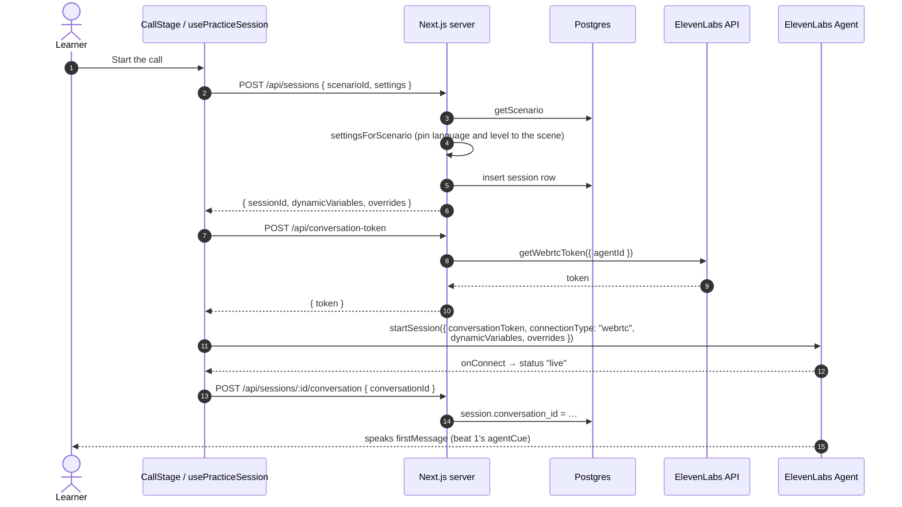
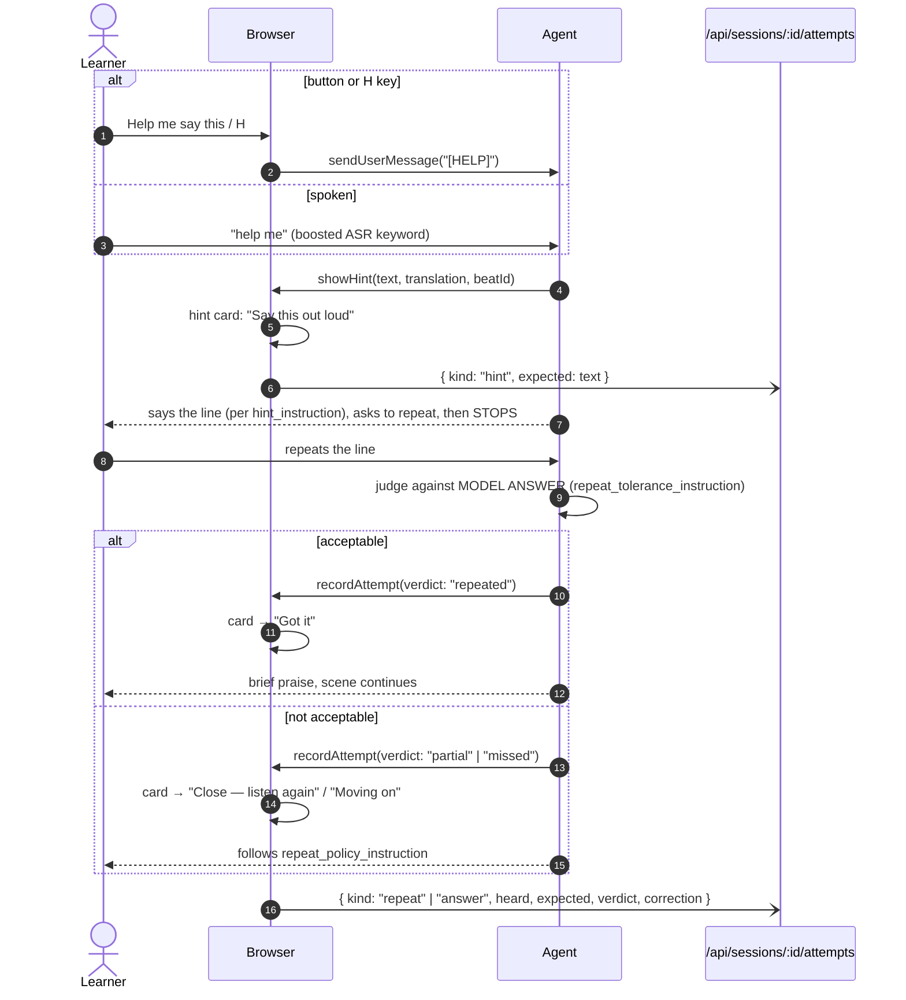

# The voice call

The live conversation is one ElevenLabs Agents session that the browser joins
over WebRTC. Speech recognition, turn-taking, the conversation LLM and speech
synthesis all run on ElevenLabs inside that session. The app's job is to:

1. Give the agent the scene and the rules for this run (**dynamic variables**
   and **overrides**).
2. Implement the **client tools** the agent calls to drive the screen.
3. Log everything that happens, so the debrief can be built.

Main code:
[`src/lib/voice/use-practice-session.ts`](../src/lib/voice/use-practice-session.ts),
[`src/lib/session/dynamic-variables.ts`](../src/lib/session/dynamic-variables.ts),
[`agent/prompts/roleplay-tutor.md`](../agent/prompts/roleplay-tutor.md),
[`agent/tool_configs/`](../agent/tool_configs/).

## The agent

The agent is defined as code. The prompt is Markdown, and
[`agent/build.mjs`](../agent/build.mjs) generates
`agent/agent_configs/roleplay-tutor.json` from it plus the tool ids in
`tools.json`. Edit the `.md` file, never the JSON. See
[Configuration and operations](configuration-and-operations.md#the-agent-as-code)
for the push workflow.

| Setting | Value | Why |
| --- | --- | --- |
| LLM | `gemini-2.5-flash`, temperature 0.3, `ignore_default_personality` | Fast, and stays within the scripted scene |
| ASR | `scribe_realtime`, quality `high`, PCM 16 kHz | Per-call keywords are added as an override |
| TTS | `eleven_flash_v2_5`, default voice `cjVigY5qzO86Huf0OWal`, latency optimisation 3 | Must be multilingual because the language is overridden per call |
| Base language | `es` | Matches the app's default. With English here, the API rejects the multilingual TTS model when the agent is created |
| Turn timeout | 12 s, mode `turn` | Learners pause mid-sentence while they build a reply. A short timeout cuts them off |
| Max duration | 3600 s | A hard platform ceiling. The real limit is the browser timer |
| `client_events` | includes `client_tool_call` | Setting this list replaces the defaults. Without `client_tool_call`, hints never reach the screen |
| Overrides enabled | TTS `voice_id`, `speed`. ASR `keywords`. Agent `first_message`, `language`. Conversation `text_only` | **Prompt override is disabled**, so the prompt can only be changed by pushing the agent |
| Evaluation criteria | `goal_achieved`, `stayed_in_target_language`, `all_beats_covered` | Returned in the post-call webhook |
| Data collection | `hint_count`, `beats_completed`, `mistakes`, `learner_level_estimate` | Returned in the post-call webhook |

> **Overrides fail silently.** If an override is not enabled under the agent's
> *Security → overrides*, ElevenLabs ignores it without an error. Every scene
> then runs in the base language at default speed.

### What the prompt tells the agent

[`roleplay-tutor.md`](../agent/prompts/roleplay-tutor.md), in short:

- **Stay in the scene.** You are this person in this place, not a teacher or an
  assistant.
- **Pitch everything at the learner's level** or one notch below.
- **Ask, then stop.** Use one or two sentences per turn. Never answer your own
  question, never supply the learner's line unless they asked for help, and
  never fill a silence.
- **Go through the beats in order**, one per exchange, and call `advanceBeat`
  each time.
- **Follow the help protocol exactly** (below).
- **Log** each judged turn (`recordAttempt`) and each mistake (`logMistake`),
  and call `endScenario` once at the end.
- **Watch the time.** If time is nearly up, steer to the closing rather than
  stopping mid-scene.
- **One scene per call.** If the learner asks to practise something else, tell
  them they can end the call and pick a new situation, then carry on.

## Starting a call



Notes:
- **The scene decides the language.** The browser sends the learner's current
  settings, but `settingsForScenario()` replaces `targetLanguage`, `cefrLevel`
  and (when the scene records it) `nativeLanguage` with the values the scene
  was written for. Everything else, such as hint mode and time limit, stays as
  the learner set it. That way a scene re-run after the learner switched
  language still gets an agent speaking the scene's language. The pinned
  settings are also what the session row stores.
- The status moves through `idle → preparing → connecting → live`. Any failure
  sets `error` and shows the message.
- The session row is created **before** the token is minted. If minting or
  connecting fails, the row stays with no outcome and shows as *Unfinished* in
  history.
- Binding the `conversationId` is what lets the post-call webhook and the audio
  download find this session.

## Dynamic variables

ElevenLabs dynamic variables must be strings, numbers or booleans, so anything
structured is rendered to text on the server. `buildDynamicVariables(scenario,
settings)`, called with the pinned settings, is the only producer of these values. A test checks that every
`{{placeholder}}` in the prompt has one.

| Variable | Source |
| --- | --- |
| `agent_name`, `agent_role`, `agent_persona` | `scenario.agentRole` |
| `setting`, `closing` | `scenario` |
| `user_role`, `user_goal` | `scenario.userRole` |
| `beats_block` | `renderBeats(scenario)` (see below) |
| `vocabulary_block` | `- term — translation (note)` lines, or `(none)` |
| `success_criteria` | `scenario.successCriteria` joined with `; ` |
| `cefr_level`, `help_trigger`, `max_duration_minutes` | `settings` |
| `hint_instruction` | from `hintMode` + `hintLength` |
| `repeat_policy_instruction` | from `repeatPolicy` |
| `repeat_tolerance_instruction` | from `repeatTolerance` |
| `correction_style_instruction` | from `correctionStyle` |
| `language_policy_instruction` | from `allowNativeLanguage` + `hintMode` |
| `scenario_title`, `beat_count`, `target_language`, `native_language` | Passed, but not referenced directly by the current prompt. The language names already appear inside the instruction strings |

`beats_block` is plain text rather than JSON because the agent follows prose
instructions more reliably than a nested object. Here is the first beat of the
seeded `demo-pharmacy-es` scene:

```
BEAT 1 (id: greeting)
  Goal: Greet and say why you are there
  You might open with: "Buenas tardes. ¿En qué puedo ayudarle?"
  MODEL ANSWER (this is what you give if they ask for help): "Buenas tardes, me duele la garganta."
  Its meaning: Good evening, my throat hurts.
  Key phrases: me duele la garganta
  Move on when: A symptom has been named
```

### How settings become instructions

| Setting | Value | Instruction the agent receives (abridged) |
| --- | --- | --- |
| `hintMode` | `target-only` | Say the model answer once, in the target language only. No translation, no explanation |
| | `target-plus-translation` | Same audio. The translation is already on screen, so never say it aloud |
| | `native-cue-first` | First ONE short sentence in the native language saying what to express, then the model answer in the target language |
| `hintLength` | `short` / `full-sentence` | "Shortest natural line that does the job" / "a full, complete sentence" |
| `repeatPolicy` | `two-tries` | On a miss: correct the specific part, say it again, ask again. After a second miss, `recordAttempt` with `missed` and move on. Never stall |
| | `hard-gate` | Don't move on until it is repeated acceptably, however many tries it takes |
| | `one-try` | Take the first attempt, record an honest verdict, move on regardless |
| `repeatTolerance` | `strict` | Near-verbatim: every content word, right order, correct endings |
| | `normal` | Every content word, even if articles, inflections or filler differ |
| | `lenient` | Same meaning, and most key phrases are there |
| `correctionStyle` | `in-flow` | Recast mistakes briefly in character and carry on. Never lecture |
| | `end-only` | Never break character. Log every mistake for the debrief |
| `allowNativeLanguage` | `true` | Target by default. One native sentence allowed when the learner is truly stuck |
| | `false` | Target only. In `native-cue-first` mode, the one cue sentence is the only exception |

## Overrides

`buildOverrides(scenario, settings)` returns:

| Override | Value |
| --- | --- |
| `agent.language` | Primary subtag of the scene's target language (`es-ES` → `es`) |
| `agent.firstMessage` | `scenario.beats[0].agentCue`, so the agent opens the scene |
| `tts.voiceId` | `settings.voiceId ?? scenario.agentRole.voiceId`. Omitted if neither is set, which is the default. The agent's own voice is then used |
| `tts.speed` | `slow` → 0.8, `normal` → 1.0 |
| `asr.keywords` | The help-trigger words, plus vocabulary terms, plus every beat's key phrases. Deduplicated and capped at 50 (the platform limit) |

ASR keywords are a cheap accuracy gain. The scene's own words and the spoken
help trigger are exactly the words that must not be misheard.

## Client tools

The agent calls these, and they run in the browser
(`useConversationClientTool` in `usePracticeSession`). Handlers never throw.
Their logging is fire-and-forget, and each returns a short string to the agent.

| Tool | Agent calls it… | Browser does | Logged as (`attempt.kind`) |
| --- | --- | --- | --- |
| `showHint { text, translation, beatId }` | Before speaking any hint | Shows the hint card (`awaiting`) and increments *hints used* | `hint`, with `expected = text` |
| `advanceBeat { beatIndex, satisfied }` | At the start of each new beat (0-based) | Clamps the index to range and moves the tracker. Clears the hint card **unless** it belongs to the new beat (a hint the learner is about to say is never removed) | not logged |
| `recordAttempt { beatId, heard, expected, verdict, correction }` | After each judged learner turn, including hint repetitions | If it matches the current hint's beat and the verdict is not `answered`, sets the card's outcome | `repeat` for `repeated` and `missed`, and for `partial` while a hint for that beat is still open. Otherwise `answer` (see `attemptKind()` in `src/lib/voice/attempts.ts`) |
| `logMistake { heard, correction, category }` | Once per discrete mistake | Adds it to the in-memory mistakes list | `mistake`, with `beatId` = current beat |
| `endScenario { outcome, summary }` | Once, after the closing line | Sets the outcome, posts `/end` and ends the session | session `outcome` and `summary` |

`verdict` values: `answered` (unaided and acceptable), `repeated` (hint repeated
acceptably), `partial` (close but flawed), `missed` (failed after the allowed
tries).

`category` values: `grammar`, `vocabulary`, `word-order`, `register`,
`pronunciation`.

## The help loop

This is the core interaction, and the reason the tools are designed as they are.



Points that matter:
- **`[HELP]` never goes through ASR.** The button and <kbd>H</kbd> send a
  literal text message, so they cannot be misheard. The prompt tells the agent
  to treat it exactly like the spoken trigger and never to mention the button.
  The <kbd>H</kbd> key is ignored while focus is in an input, textarea, select
  or contenteditable element, or when a modifier key is held.
- **`showHint` comes first**, so the line is on screen before it is spoken. A
  learner cannot repeat a line they only half-heard.
- **The repetition is the point.** The prompt forbids skipping the
  repeat-and-wait step and forbids saying the line as if the learner had said
  it.
- **Grading is the agent's judgement.** The similarity score stored with each
  attempt is computed on the server afterwards and is only for the debrief (see
  [Data model](data-model.md#similarity-score)). It does not gate anything.
- **`two-tries` is the default** because with `hard-gate`, a single ASR mistake
  can stall the conversation.

## Turn-taking and "Done speaking"

The agent ends a turn when its turn detector hears enough silence. In a noisy
room that can take a while. **Done speaking** (`finishTurn`) mutes the
microphone, which sends clean silence and lets the detector end the turn
promptly. The SDK has no explicit "commit turn" command. The mic is unmuted
when:
- the agent starts speaking (`onModeChange` → `mode === "speaking"`), or
- a 4-second safety timer fires.

The button is disabled while the agent is speaking, while muted or while a turn
is already being submitted.

## Transcript and timing

`onMessage` fires for every agent and learner line. For each one the browser:
1. Creates a `TranscriptEntry` with a client-generated id and the SDK's
   `event_id`.
2. For learner lines, records which of the scene's **recommended terms**
   (vocabulary terms and key phrases) appear. The match ignores case and
   diacritics and uses word boundaries, so `pan` does not match `pantalla`.
3. For agent lines, records `agentResponseMs`: the time since the last learner
   line arrived, measured in the browser with `performance.now()`.
4. Shows it and POSTs it to `/api/sessions/:id/messages`. The client id makes
   retries idempotent.

`modelResponseMs` (the LLM's time to first byte) and `modelName` are not
available during the call. They are added later from the post-call webhook's
turn metrics (see [Data model](data-model.md#webhook-enrichment)).

## Ending a call

| Trigger | `outcome` | `summary` |
| --- | --- | --- |
| The agent calls `endScenario` | What the agent chose: `goal-achieved`, `partial`, `abandoned` or `out-of-time` | One sentence from the agent, in the learner's native language |
| The learner presses **End the call** | `abandoned` | "The learner ended the call." |
| The browser timer reaches `maxDurationMinutes` | `out-of-time` | "The session reached its N minute limit." |
| The connection drops (`onDisconnect` while live) | not set (stays *Unfinished*) | not set |

The first three POST `/api/sessions/:id/end` and call `endSession()`. In every
case the status becomes `ended`, and `CallStage` immediately routes to
`/debrief/<sessionId>`.

The time limit is enforced in two places. The prompt tells the agent the limit
(`max_duration_minutes`) so it can steer to the closing, and the browser timer
actually ends the call.
